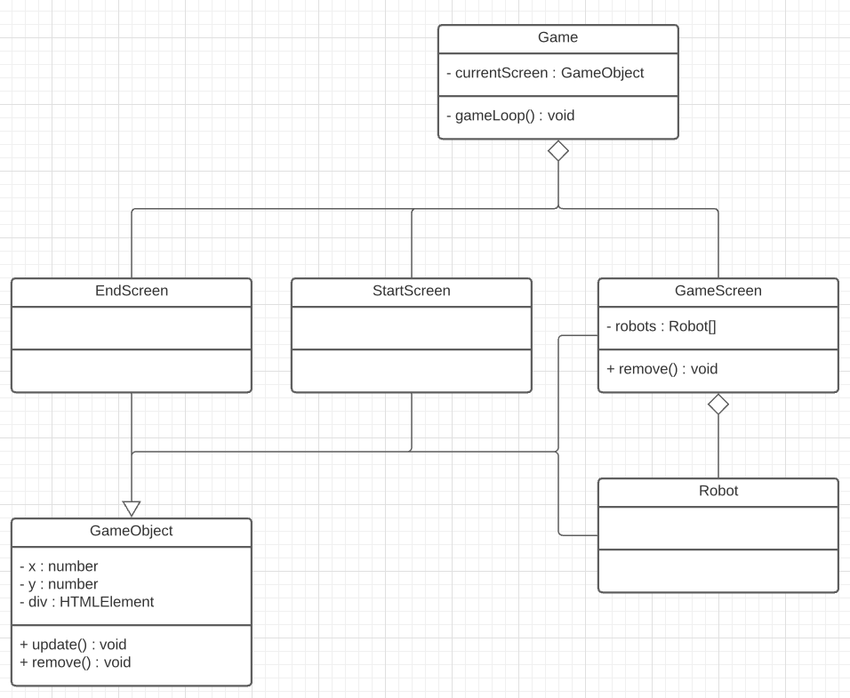

# CMTTHE04-1 Week 7 - Werken met Classes

1. Een Class maken voor de speech API
2. Verwijderen van objecten
3. Wisselen tussen schermen
4. BONUS - Een Class maken om een 🐹 hamster GIF te laden

<br>
<br>
<br>
<br>

# Een Class maken voor de speech API

De [Speech API](https://github.com/HR-CMGT/PRG08-2020-2021/blob/main/snippets/speech.md) heeft een eigenschap `synth` en een function `speak`. Hoe kunnen we hier een class van maken?

Gebruik hiervoor het [typescript startproject](https://github.com/HR-CMGT/Typescript-startproject), of je kan op [CodePen](https://codepen.io) een Typescript project starten. 

```typescript
let synth = window.speechSynthesis

function speak(text) {
    if (synth.speaking) {
        // still speaking...
        return
    }
    if (text !== '') {
        let utterThis = new SpeechSynthesisUtterance(text)
        synth.speak(utterThis)
    }
}
```
Het eindresultaat zou als volgt kunnen werken:
```typescript
let assistant = new Speech()
assistant.speak("One falafel please")
```
Je kan [deze codepen](https://codepen.io/eerk/pen/OJprpeL?editors=0010) gebruiken om te oefenen.

### Voices

Je kan de `voice` ook een property van de class maken:
```typescript
let voices = window.speechSynthesis.getVoices();
let name = "Alex"
utterance.voice = voices.filter(function(voice) { return voice.name == name; })[0];
```
De beschikbare voices op jouw apparaat kan je [hier checken](https://developer.mozilla.org/en-US/docs/Web/API/SpeechSynthesis/getVoices)


<br>
<br>
<br>
<br>


# Verwijderen van objecten

In de `gamescreen` van dit project zitten een aantal clickable robots. Deze worden geupdate via een Array. Als je op de robot klikt krijg je een punt, en de robot verdwijnt uit het spel. Om de robot te laten verdwijnen moeten we:

- Robot DOM element verwijderen.
- Robot instance verwijderen uit de Array, zodat de `update()` niet meer wordt aangeroepen.

<br>
<br>
<br>
<br>

# Wisselen tussen schermen

We gebruiken **composition** om te kunnen wisselen tussen schermen. Elk scherm krijgt een eigen Class waarin game elementen geplaatst worden. Vanuit `game.ts` wordt alleen nog maar de `update` van het huidige scherm aangeroepen.



Het is belangrijk dat al deze classes een update en remove functie hebben.

<br>

## Switch screen

Game.ts krijgt een property om te onthouden wat het huidige scherm is. De `switchScreen` functie verwijdert het vorige scherm en plaatst dan een nieuw scherm.

```typescript
export class Game {

    private currentScreen:GameObject

    constructor(){
        this.currentScreen = new Startscreen(this)
        this.gameLoop()
    }

    private gameLoop(){
        this.currentScreen.update()
        requestAnimationFrame(()=>this.gameLoop())
    }

    public switchScreen(screen:GameObject) {
        this.currentScreen.remove()
        this.currentScreen = screen
    }
}
```

<br>

## Switch sreen aanroepen vanuit een andere class

Om `switchSreen` aan te kunnen roepen vanuit het startscherm, moet het startscherm eerst een verwijzing naar de game krijgen.

```typescript
export class Startscreen extends GameObject {
    private game:Game
    constructor(g:Game) {
        super("startscreen")
        this.game = g
    }
}
```
Vervolgens kan je van scherm wisselen door een `new Gamescreen` scherm aan te maken en dat aan de game te geven!

```typescript
let newScreen = new Gamescreen(game)
this.game.switchScreen(newScreen)
```

<br>

## DOM Objecten verwijderen

Om zeker te weten dat alle DOM elementen verwijderd worden moet elk scherm een `remove` functie hebben. In gamescreen wordt dit gebruikt om alle robots te verwijderen. Roep ook `super.remove()` aan om de gamescreen div te verwijderen.

```typescript
public remove() {
    for (let o of this.robots) {
        o.remove()
    }
    super.remove()
}
```

<br>
<br>
<br>
<br>

# 🐹 HAMSTER BONUS

## Een random hamster inladen met een class

Met onderstaande code kan je een afbeelding van GIPHY inladen. 

⚠️ LET OP, je moet je eigen API KEY aanmaken via [het giphy developer portal](https://developers.giphy.com/docs/api#quick-start-guide)

```typescript
function loadHamster(){
    let apikey = "YOUR_API_KEY"
    let random = Math.floor(Math.random() * 100)
    fetch(`http://api.giphy.com/v1/gifs/search?q=hamster&offset=${random}&api_key=${apikey}`)
        .then(res => res.json())
        .then(res => hamsterLoaded(res.data[0].images.original.url))
}

function hamsterLoaded(url:string){
    // set the src of an  to this url
    console.log(url)
}
```

Hoe kunnen we hier een class van maken? Het eindresultaat zou als volgt kunnen gaan werken:

```typescript
let loader = new HamsterLoader()
loader.loadHamster()
```

<br>
<br>
<br>
<br>
